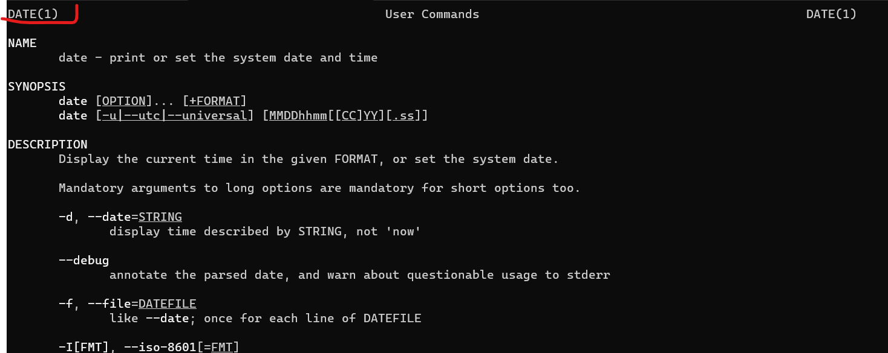

# Linux常用的命令

如果需要查询命令的用法可以使用man或者help来查询。    
`man 要查询的命令`    
eg. man date    
    
在图里面的DATE(1)    
数字1是指使用者在shell环境中可以操作的指令或可执行的文件。    
数字5是指配置文件或是某些文件的格式。
系统管理员可用的管理指令。    

ls命令是列出当前文件。    
ls -al 是列出所有的文件详细的权限与属性（包含隐藏文件，.开头的文件就是隐藏文件）。    
    
