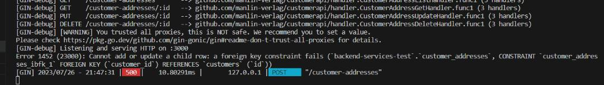
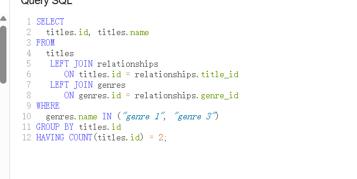

# 出现Cannot add or update a child row: a foreign key constraint fails错误
    
如果出现以上的错误，先是要检查向表里添加的属性的主键和外键是否一致。    
然后在检查写的endpoint里面的body的主键和外键是否一样。 例如下面的例子    
 
外键customerId是要和这个表的外键值一样的。   

# 在使用GROUP BY注意的事项。

用了group by之后，select里面就只能加titles里面的内容，不能加其他表里面的内容了。