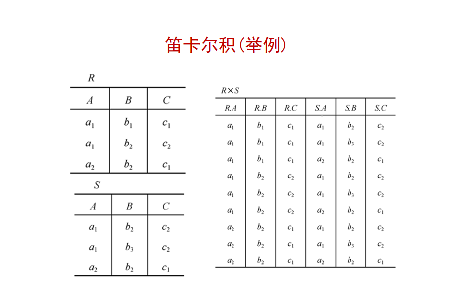
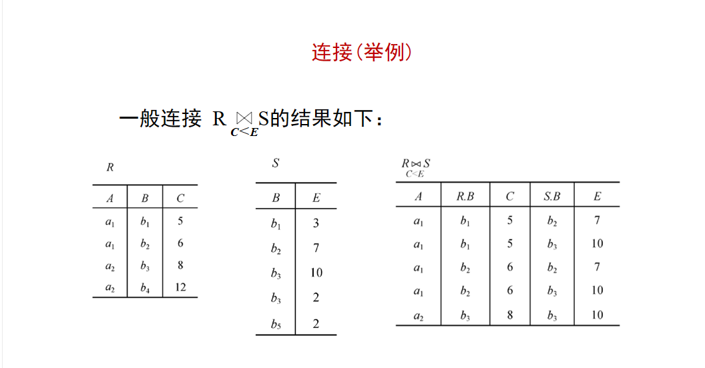
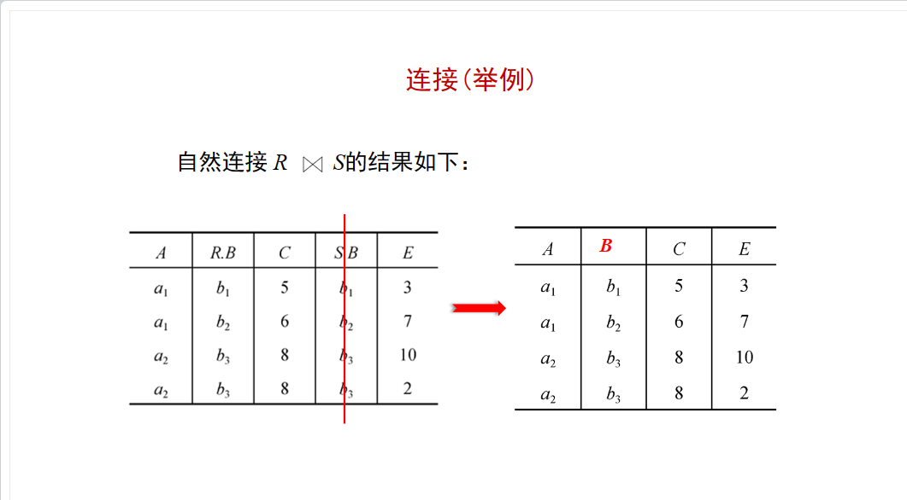

# 关系数据库笔记

关系数据库模型    
------------------------------------------
关系数据库系统是指支持关系模型的数据库系统。    
关系数据模型是指关系数据结构、关系操作集合和关系完整性约束。    

关系数据结构    
----------------------------------------
关系数据结构只包含一种数据结构，就是关系。    

基本术语    
-----------------------------------------
- 表（Table）由表名、构成表的各个列及若干行数据组成的二维数据结构。    
  - 每个表都有一个唯一的表名，每个列都描述了具体的记录值。    
- 关系（Relation）一个关系逻辑上对应一张表，也就是说一张学生表也是学生表关系。    
  - 三种关系类型：
    - 基本关系也就是基本表，是存储数据的逻辑关系的基本表。
    - 查询表是查询对应的表。
    - 视图表是由基本表或其他视图导出的虚表。虚表是不存储数据的表。
- 列（Column）表中每一列成为列名，每个列表示一个实体的一个属性，具有相同的数据类型。如下的例子   

| 中文字段 | 数据类型 | 宽度 |
| ------- | ------- | ----- |
| 学号    | 字符类型 | 10    |

| 学号 | 姓名 | 性别 | 出生日期 | 籍贯 | 民族 |
| ---- | --- | ---- | ------- | ---- | ---- |
|2023 | 江山 | 女   | 1996-03-25 | 河北 | 汉   |

- 属性（Attribute）表中的一列为一个属性，给每一个属性起一个名称即属性名，属性的个数称为关系的元或度。列的值称为属性值，属性值的取值范围称为值域。
  - 上面列中的属性有：学号、姓名、性别、出生日期、籍贯、民族是学生基本信息登记表关系的一个8元（度）的关系。 
- 行（Row）称为元组（Tuple）或者记录（Record），表中的数据是按行存储的，每行由若干字段值组成，每个字段值描述该对象的一个属性或特征。例如以上表江山这一行。
- 分量（Component）是指元组中的一个属性值。
- 码或键（Key）表中的某个属性组，它可以唯一确定一个元组。    
- 超码或者超键（Super Key）如果在关系的一个码中移去某个属性，它任然是这个关系的码，则称这样的码为该关系的超码。
- 候选码或候选键（Candidate Key）若一个关系中有多个码，每个码都被称作候选码或候选键。 
- 主码或主键（Primary Key）指若一个关系有多个候选码中指定一个用来唯一标识关系的元组。   
- 全码或全键（All-Key）一个关系模式的所有属性集合。
- 主属性（Primary Attribute）在数据库中，主属性是指包含在任何一个候选键中的属性。例如，在关系——学生（学号，姓名，年龄，性别，班级）中，如果主码是“学号”，那么“学号”就是主属性1。这是因为它是构成某一个候选关键字的属性集中的一个属性。
- 非主属性（Nonprimary Attribute）在数据库中，非主属性是指不包含在任何候选键中的属性。例如，在关系——学生（学号，姓名，年龄，性别，班级）中，如果主码是“学号”，那么“姓名”，“年龄”，“性别”和“班级”就是非主属性。这是因为它们不是构成任何一个候选关键字的属性集中的一个属性。
- 外码或者外键（Foreign Key）外键是用来建立两张表之间的关联关系的字段，是另一张表的主键。 外键是一种强制性的约束，确保了数据库中的数据的一致和完整性。
- 参照关系（Referencing Relation）通常是指两个表之间的关系，以外键作为主键的关系称为被参照关系（Referenced Rellation）也称主关系，外码所在的关系称为参照关系，也称为从关系。
- 域（Domain）表示属性的取值范围。
- 数据类型（Data Type）表中每个列都有相应的数据类型。
- 关系模式（Relation Schema）是对关系的描述。    
- 关系数据库（Relation Database）是一种基于关系模型的数据库。

关系操作集合    
--------------------------------------------
1. 基本的关系操作    
   - 查询（Query）是关系操作中最主要的部分，可以分为选择、投影、并、差、笛卡尔积五种基本操作。
   - 插入（Insert）
   - 删除（Delete）
   - 修改（Update）
   - 关系操作的特点是集合操作方式，即操作的对象和结果都是集合，也称为一次一集合（set-at-a-time）的方式。
2. 关系数据语言的分类
   关系操作是通过关系语言来实现的，关系语言的特点是高度非过程化。    
   关系数据语言分为关系代数语言，关系演算语言和兼具两者双重特点的语言（列如SQL）。
   - 关系操作用两种方式来表示：代数方式和逻辑方式。 
     - 代数方式主要是关系代数语言用对关系的运算来表达查询要求。
     - 逻辑方式
3. 关系代数
   操作三大要素：操作对象，操作符，操作结果。
   

   1. 传统的集合运算
     - 并（UNION）是指关系R1或者R2的所有不同元组所组成，记为R3=R1UR2。R1和R2的属性个数相同，且相应属性分别有相同的值域。        
         
     - 差（DIFFERENCE）R1和R2的差运算产生一个新关系R3.R3是由属于关系R1，但不属于R2的元组组成，记为R3=R1-R2.进行差运算的两个关系必须具有相同的属性个数，且相应属性具体相同的值域。    
         
     - 交（INTERSECTION）R1和R2相交产生一个新关系R3，R3是既属于关系R1，同时又属于R2的元组组成。R3=R1ՈR2。    
         
     - 笛卡尔积（CARTESIAN PRODUCT）R1为m元关系，R2为n元关系，R1和R2的笛卡尔积产生一个新关系R3，记作R1XR2。R3是由R1和R2的所有元组链接而成的。    
         
   2. 专门的关系运算
     - 选择（Select）是指定关系中选取满足给定条件的若干元组组成一个新关系。
       - SELECT 关系名 WHERE 条件。 其中条件是由常数、属性名或列名、比较操作符以及逻辑操作服组成的条件表达式。
         - SELECT R1 WHERE 性别=“男”    
          
     - 投影（PROJECTION）从指定的关系中选取指定的若干属性值组成一个新关系。这个新关系中不包含重复元组。
       - PROJECTION 关系名（属性名1，属性名2，...，属性名n）     
         - PROJECTION R1（学号，宿舍）
          
     - 连接（JOIN）是选取两个指定关系中的属性满足给定条件的元组连接在一起来组成一个新关系。
       - 连接的等值连接和自然连接最常用。    
         - 等值连接是条件“=”的连接运算符称为等值连接，从关系笛卡尔积选取A、B属性相等的那些元组。
         - 自然连接是一种特殊的等值连接。会去掉重复的属性列。    
           
      
          
     - 除（DIVISION）
          
          
          
           
   3. 关系的完整性约束
     数据库的数据完整性是指数据库中数据的正确性、相容性和一致性。    
     关系模型中有三类完整性约束，其中的实体完整性和参照完整性是关系模型必须满足的完整性约束条件称为关系的两个不变性。    
     - 实体完整性约束（Entity Integrity Constraint）        
           
     - 参照完整性约束（Referential Integrity Constraint）    
          
     - 用户定义完整性约束（User-defined Integrity Constraint）   
          
关系数据库的规范化理论    
-------------------------------------------
  1. 关系模式中可能存在的冗余和异常问题    
    - 数据冗余是指同一个数据被反复存储的情况。例如：供应商可供应100种货，则地址没存储100次。    
    - 更新异常是数据冗余将导致存储空间的浪费和潜在数据不一致性及修改麻烦等问题。例如：供应商供应的100种货，地址发生变化，其中一个地址没有修改。就会造成实际情况不符的错误。
    - 插入异常是指应该插入到数据库中的数据不能执行插入操作的情况。
    - 删除异常是不应该被删除的数据被删除的情况。