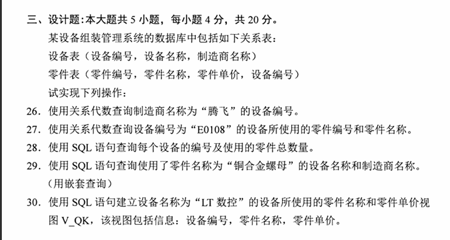
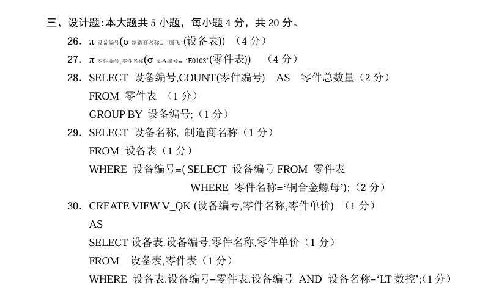
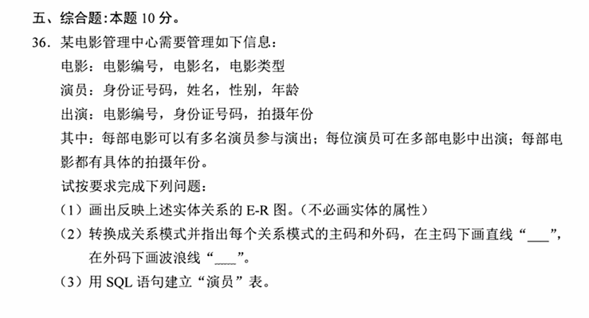
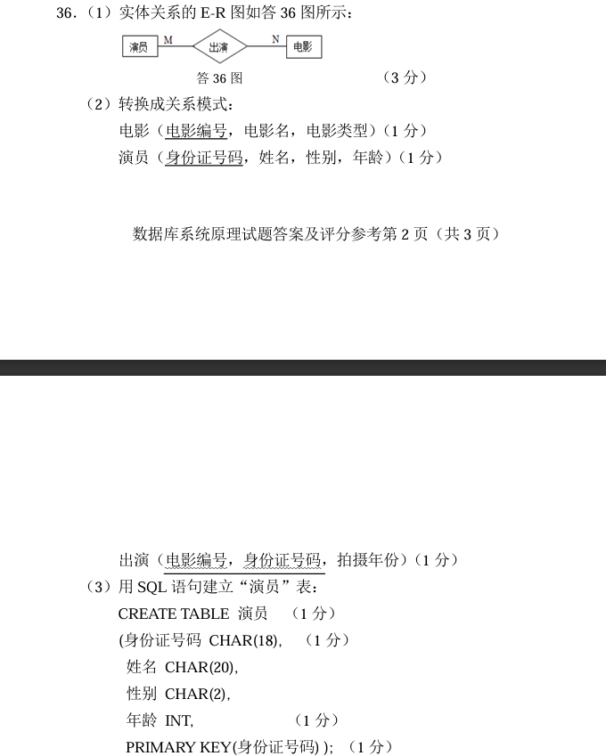
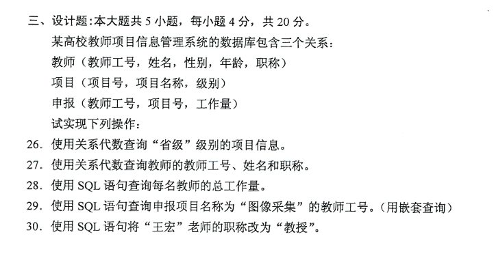
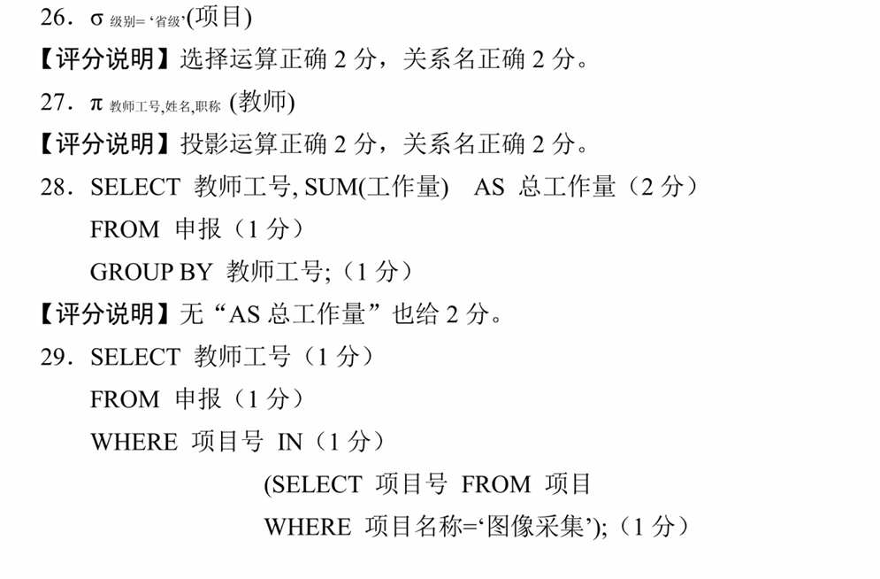
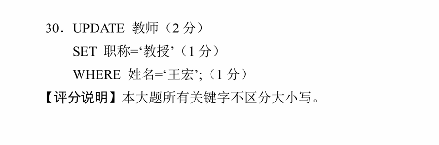
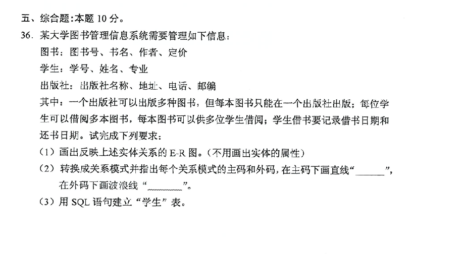
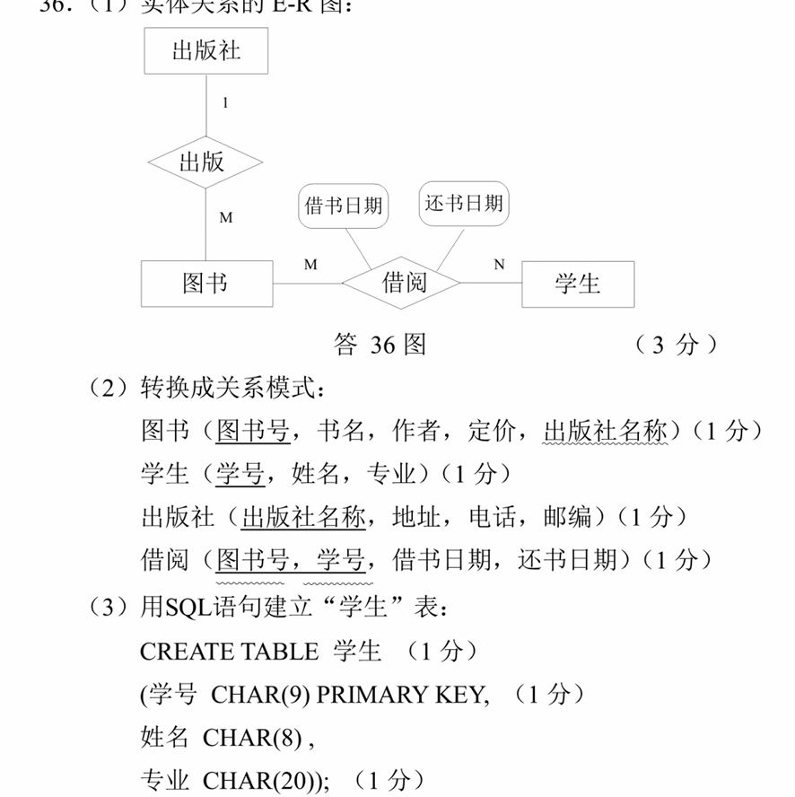

- @是声明用户变量。
- MySQL中，循环流程控制语句关键字
  - LOOP 
  - REPEAT是用于将字符串重复指定的次数
  - WHILE
- CONSTRAINT是命名完整性约束的关键字。
- DROP USER删除一个或者多个MySQL用户账户及消除相关的权限。而truncate和delete只要会删除数据不会删除表的结构。
- 数据仓库重要概念是粒度，分割，维。
- 数据挖掘的过程首先要完成确定业务对象。
- 二维表结构来表示实体与实体之间联系的模型是关系模型。
- 关系模型的三个组成要素是关系数据结构，关系操作集合和关系完整性约束。
- 在关系数据库中，关系模式是静态的、稳定的。
- 从用户对数据的需求出发，数据库设计包括数据库结构设计和数据库行为设计。
- 数据库生命周期分为数据库分析与设计阶段和数据库实现与操作。
- 在MYSQL的存储过程体中，SELECT...INTO语句返回的结果集有一行数据。
- 反应数据库中数据正确性和相容性的是数据库完整性。
- 触发器是用户定义在关系表上的一类由事件驱动的数据库对象。     
    
     
- 关系模型的三类完整性约束是实体完整性约束，参照完整性约束和用户自定完整性约束。       
- 视图是数据库中的一个对象，它是数据库管理系统提供给用户的以多种角度观察数据库种数据的一种重要机制。 视图与三级模式中相对应的模式是外模式。    
- 简述使用存储过程的优点。
  - 增强SQL语言的功能和灵活性。    
  - 良好的封装性。    
  - 高性能
  - 可减少网络流量。
  - 可作为一种安全机制来确保数据库的安全和数据库的完整性。
- 并发操作带来数据不一致的主要原因及解决方法。
  - 主要原因是并发操作破坏了事务的隔离性。
  - 解决方法是封锁、时间戳、乐观控制法和多版本并发控制。
- MySQL中备份数据的语句及功能
  - SELECT...INTO..OUTFILE
  - 通过SELECT语句讲表中所有数据行写入一个文件中。    
    
    

- 单机方式是指客户端和服务端可以同时工作在同一台计算机上。    
- 在关系中，每一个属性都是不可分解的。    
- 建立索引的方式通常是静态和动态    
- 删除存储过程可以使用DROP PROCEDURE，避免在没有触发器的情况下删除触发器的关键字是IF EXISTS
- GRANT语句中，授予用户创建和删除新用户的权限，语法项目"priv_type"的值是Create user
- MySQL中，导入恢复数据的语句是LOAD DATA...INFILE
- 联机分析处理是针对某些主题的历史数据进行分析，支持管理决策的。    
- 聚类是指通过数据挖掘ishu，可以把数据按照相似性归纳成若干类别。
- 数据的集成是数据库管理系统的主要目的。
- 数据库分析与设计阶段不包括需求分析，概念设计，逻辑设计和物理设计四个环节。
- MySQL中，一个关系对应一个基本表，一个或者多个基本表对应一个存储文件。
- 对于填有数据的游标，在MySQL中，可以使用FETCH...INTO语句来读取数据。
- 完整性约束条件的作用对象可以是列、元组、和表组成。
- 用户定义在关系表上的一类由事件驱动的数据库对象，称为触发器，它也是一种保证数据完整性的方法。
- 分割是将数据分散到各自的物理单元中，以便能分别处理，以提高数据处理的效率。
- 大数据是指无法在可容忍的时间内用现有信息技术和软，硬件工具对惊醒感知，获取，管理、处理的服务的数据集合。    
    
    
    
- 关系数据模型的优化方法
  - 确定各属性见的函数依赖关系
  - 对于各个关系模式之间的数据依赖进行极小化处理，消除冗余的联系。
  - 判断每个关系模式的范式，根据实际需要确定最合适的范式。
  - 按照需求分析阶段得到的处理要求，对某些模式进行合并或分解。
  - 对关系模式进行必要的分解，提高数据操作的效率和存储空间的利用率。
- 关系数据模型完整性约束的检验方法。
  - 执行插入操作时，首先检查实体完整性约束。然后检查参照完整性约束，最后检查用户定义完整性约束。
  - 执行删除操作时，一般只需要对被参照关系检查参照完整性约束。
  - 执行更新操作时，因为更新操作可看成是先执行删除操作，在执行插入操作。
- 简述SQL核心组成部分
  - 数据定义语言。
  - 数据操作语言。
  - 数据控制语言。
  - 嵌入式和动态SQL规则
  - SQL调用和会话规则  
- 删除存储的语句及注意事项。   
  - 删除语句：DROP FUNCTION
  - 删除之前，必须确认该存储函数有没有任何依赖关系，否则会导致其他与之关联的存储函数无法运行。
  - 为防止因删除不存在的存储函数引发的错误，可在DROP FUNCTION语句中添加关键字“IF EXISTS”。
- 简述三种典型的并发操作问题。
  - 丢失更新。设有两个事务T1和T2，当它们同时读入同一个数据并加以修改时，事务T2的提交结果会破坏事务T1提交的结果。
  - 不可重复读。两个事务T1和T2，不可重复读是指事务T1读取数据后，事务T2执行更新操作，使事务T1无法在现前一次读取结果。
  - 读“脏”数据。事务T1修改某一个数据，并将其写回磁盘，事务T2读取同一个数据后，事务T1由于某种原因被撤销，这时事务T1以修改过的数据恢复原值，事务T2读到的数据就与数据库中的数据不一致，则T2读到的数据为脏数据。       
    
    