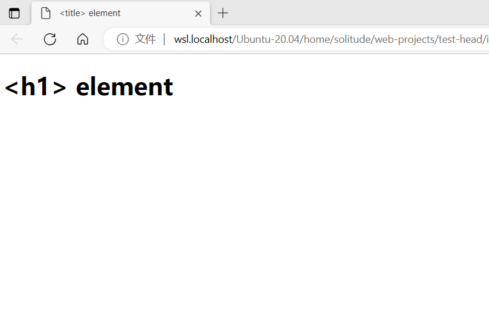
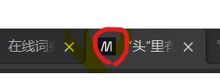

# HTML的元信息 
  页面在加载完成后，`<head>`里的信息是不会显示在浏览器中的。它的作用是保存页面的一些元数据。     
  元素据就是描述数据的数据。     
  `<title></title>`元素是一项元数据，用来表示整个HTML文档的标题而不是文档的内容。请看下面例子：      
```html
<!DOCTYPE html>
<html lang="en">
<head>
  <meta charset="UTF-8">
  <meta name="viewport" content="width=device-width, initial-scale=1.0">
  <title>&lt;title&gt; element</title>
</head>
<body>
  <h1>&lt;h1&gt; element</h1>
</body>
</html>
```
运行的效果是：    
     

`<meta>`元素      
---------------------------------------
  `<meta charset="utf-8"/>`是指定文档的字符编码。    

  `<meta name="author" content="Chris Mills" />`    
  name属性主要是用于描述网页，比如网页的关键词，叙述等。与之对应的属性值为content，content中的内容是对name填入类型的具体描述，便于搜索引擎抓取。           
  name属性的几种参数。     
  - keywords（关键字）告诉搜索引擎，你网页的关键字。    
  `<meta name="keywords" content="PHP中文网">`    
  - description（网站内容的描述）用于告诉搜索引擎，你网站的主要内容。    
  ```html
  <meta
  name="description"
  content="The MDN Web Docs site
  provides information about Open Web technologies
  including HTML, CSS, and APIs for both Web sites and
  progressive web apps." />
  ```      
  使用搜索引擎搜索网址时，会显示的信息，例如
  
  - author（作者）

在站点增加自定义图标    
----------------------------------------------------------
什么是页面图标    
以下圈红圈的就是图标，一般这个图标是16像素的方形图标，以.ico格式保存。    
    
创建页面图标有两种方式：    
  - 将图标存放在与网站的索引页面相同的目录中，一般是.ico格式（浏览器可能支持别的格式，如.gif或.png）浏览器会自动识别.
  - 或者在<head>块中引用<link>:    
    `<link rel="icon" href="favicon.ico" type="image/x-icon"/>`  
    rel="icon"表明这是文档的样式表，而href包含了样式表文件的路径    
      
    ```html
    <!DOCTYPE html>
    <html lang="en">
    <head>
      <meta charset="utf-8">
      <meta name="viewport" content="width=device-width, initial-scale=1.0">
      <title>&lt;title&gt; element</title>
      <link rel="icon" href="images/test.ico" type="image/x-icon" />
    </head>
    <body>
      <h1>&lt;h1&gt; element</h1>
      <p>Japanese example: ご飯が熱い。</p>
    </body>
    </html>
    ```

[Web](../../web.md) -- [html](html.md) -- [Front End](../front_end.md)