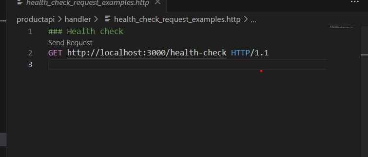
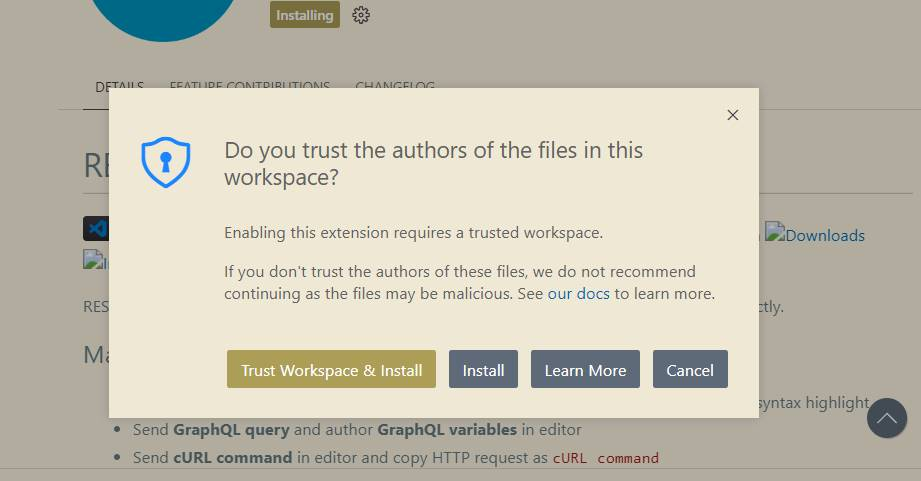
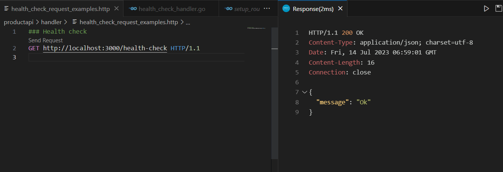

# 由于我看不懂以下代码，才了解到REST Client插件

上面是描述一个HTTP请求的例子。 是一个GET方法，URL是http://localhost:3000/health-check 版本是HTTP1.1    
主要是用来测试请求。为了能够测试，需要安装REST Client    

REST Client插件    
----------------------------------------------
Rest Client插件是一个用于发送HTTP请求和查看响应的工具。
- REST Client的安装    
  可以在vscode哪里搜索然后直接安装。    

     
由于VSCode有安全特性，防止你莫名其妙执行了别人的代码，需要你信任这个workspace。所以点第一个就好。      
安装完成后，要先启动服务`devops/devenv/start.sh`    
然后启动服务器`SERVICE_CONFIG_PATH=config.test.json go run .`    

    
查看endpoint的注册    
```go
func SetupRoutes(app *gin.Engine, g *model.GlobalInstances) {
	app.GET("/health-check", NewHealthCheckHandler(g))
}
```
服务器响应部分是调用NewHealThCheckHandler函数。    
